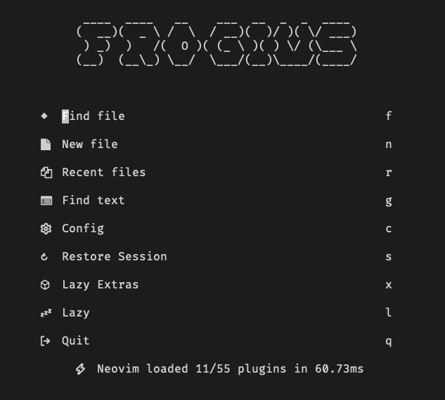

# 💤 LazyVim

A starter template for [LazyVim](https://github.com/LazyVim/LazyVim).
Refer to the [documentation](https://lazyvim.github.io/installation) to get started.

## Installation

1. Clone the content of this repository to your `~/.config/nvim` directory.
2. Remove the .git directory from the cloned repository.
3. Adjust the `alpha.lua` file to your needs.
4. Enjoy!

## Prerequisites

NeoVim 0.9.0 or later.

## Example screenshots of this configuration

| Description   | URL                                |
| ------------- | ---------------------------------- |
| Initial View  |  |
| File Explorer |  |
| File View     |  |
| Git Editor    |  |

## What to expect?

- A minimalistic and clean UI
- A curated set of plugins
- A simple and easy-to-use configuration
- A focus on productivity
- A distraction-free environment
- Copilot support
- Copilot Chat support
- Perfomance improvements
